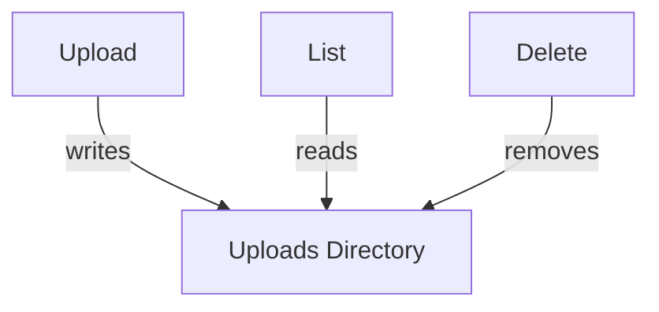
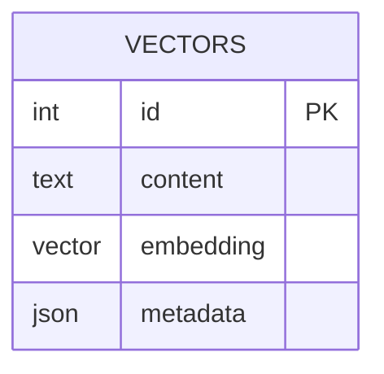

# Storage

## File Persistence

Files are stored under `packages/database/data/uploads` and can be uploaded, listed, or deleted through the storage APIs.

## Vector Index

Embeddings are generated via OpenAI's `text-embedding-3-small` model and persisted in a Postgres table using the `pgvector` extension. Queries compute similarity with `<=>` distance.
